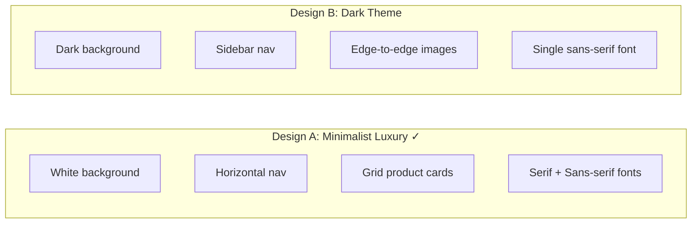
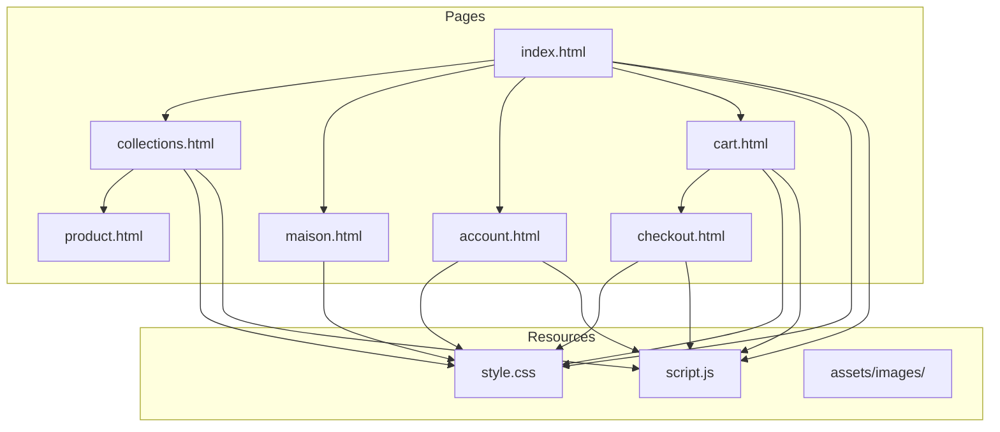

# Project Design Documentation

## HTML Basics (AC 1.1)

HTML, or HyperText Markup Language, forms the structural foundation of every web page. It uses a system of elements defined by tags to describe the content and meaning of page components. Each element begins with an opening tag containing the element name enclosed in angle brackets, followed by content, and concludes with a closing tag prefixed by a forward slash.

The document structure follows a hierarchical pattern. The doctype declaration at the very beginning tells the browser which HTML version to expect. The html element contains everything else and includes a lang attribute specifying the page language for accessibility purposes. Within this container, the head element holds metadata including the page title, character encoding declarations, viewport settings for responsive design, and links to external stylesheets. The body element contains all visible content.

Semantic elements provide meaning beyond simple presentation. The header element groups introductory content and navigation, while main encompasses the primary unique content. Section elements divide content into thematic groups, and footer contains closing information such as copyright notices and secondary links. This semantic structure improves accessibility for screen readers and helps search engines understand page content.

The Luxury Lune website employs these principles throughout. The navigation uses nav elements containing anchor links. Product grids use div elements with appropriate class attributes for styling hooks. Forms collect user input through input elements with corresponding label elements that improve usability and accessibility.

## CSS Implementation (AC 1.4)

Cascading Style Sheets control the visual presentation of HTML elements, separating content from appearance. This separation allows consistent styling across multiple pages through a single external stylesheet, reducing code duplication and simplifying maintenance.

The stylesheet begins by defining CSS custom properties, also called variables, within the root pseudo-class. These properties store values for colours, fonts, and spacing that repeat throughout the design. When the brand colour needs adjustment, changing a single variable updates every instance automatically.

```css
:root {
    --color-bg: #FFFFFF;
    --color-text: #1A1A1A;
    --font-heading: 'Playfair Display', serif;
    --font-body: 'Inter', sans-serif;
}
```

The universal selector with box-sizing border-box ensures predictable element sizing by including padding and borders within specified dimensions. This approach prevents unexpected layout overflow that commonly frustrates developers.

Typography receives careful attention appropriate to a luxury brand. Headings use the elegant Playfair Display serif typeface, communicating tradition and refinement. Body text employs Inter, a highly legible sans-serif designed for screen reading. Font weights remain light at 300 for body text, creating an airy, sophisticated appearance.

The layout leverages modern CSS features including Flexbox for navigation and Grid for product arrangements. The navigation header uses justify-content space-between to position the logo centrally with navigation groups on either side. Product grids employ repeat auto-fit with minimum column widths, creating responsive layouts that adapt to screen size without media queries.

Transitions and animations provide subtle interactivity feedback. Links fade opacity on hover through cubic-bezier timing functions that create natural movement. The hero image fades in with a gentle scale animation on page load, drawing attention without overwhelming visitors.

Media queries adjust layouts for mobile devices at the 768 pixel breakpoint. Navigation collapses into a hamburger menu, product grids reduce to two columns, and typography scales proportionally.

## Tools and Techniques (AC 3.4)

The development process utilised Visual Studio Code as the primary code editor, providing syntax highlighting, intelligent code completion, and integrated terminal access. Extensions including Live Server enabled real-time preview during development, automatically refreshing the browser whenever files changed.

Browser developer tools proved essential for debugging and refinement. The Elements panel allowed real-time CSS adjustments, while the Network panel identified performance bottlenecks. The responsive design mode simulated various device sizes without physical hardware.

Version control through Git tracked all changes, enabling safe experimentation through branches and providing rollback capability when modifications caused problems. The repository structure maintained clean separation between HTML pages, styling, scripts, and assets.

Image processing converted photography to WebP format, significantly reducing file sizes. The conversion maintained quality settings appropriate for product display while achieving compression ratios impossible with older formats.

The JavaScript follows modern standards using const and let for variable declarations, arrow functions for concise callbacks, and template literals for dynamic HTML generation. Event delegation on the body element efficiently handles interactions across dynamically rendered product cards.

---

## Review and Testing (AC 3.2)

During the testing phase, the website was reviewed across multiple browsers and device sizes to identify functional issues that affected user experience. Each page was manually tested for layout problems, broken interactions, and visual inconsistencies. The testing process revealed four distinct issues, each documented below with the root cause and the solution that was applied.

### Issue 1: Buttons Not Rendering

The most critical issue discovered was that several interactive buttons across the website either appeared invisible or lacked any visual styling. The Sign In button on the account page, the Create Account button, and the Proceed to Checkout button on the cart page all had white text against a transparent background, causing them to blend into the page. Additionally, the Add to Bag button inside the product modal appeared as a plain, unstyled browser button with no background fill, making it look broken and unprofessional.

The root cause involved two separate CSS problems. First, the stylesheet referenced a custom property called --color-text-main for the background colour of the authentication and checkout buttons, but this variable was never declared in the root scope. When the browser encountered var(--color-text-main), it resolved to nothing, defaulting the background to transparent. Second, the modal's Add to Bag button used the class modal-add-btn, but no CSS rule existed for this class. The existing add-to-bag-btn styles were scoped to the product-card parent element, so they never applied inside the modal.

The fix involved two changes. The missing --color-text-main variable was added to the root scope with the same dark value used elsewhere. A new .modal-add-btn rule was also created in the stylesheet, giving the modal button a dark background, white text, uppercase lettering, and a hover effect consistent with other call-to-action buttons across the site.

[IMAGE PLACEHOLDER: Screenshot of button not rendering before fix]

[IMAGE PLACEHOLDER: Screenshot of button rendering correctly after fix]

### Issue 2: Modal Double Scrollbar

When a user clicked on a product card to view details, the modal overlay appeared with two competing scrollbars. One scrollbar appeared on the outer modal container and a second appeared on the inner content panel. This created a confusing interaction where scrolling affected different sections depending on which scrollbar the user grabbed.

The cause was a conflict between the overflow property on the product-modal container and the overflow-y property on the modal-info inner section. The outer container had overflow set to auto, which generated its own scrollbar when content exceeded the viewport. Simultaneously, the inner info panel forced a permanent scrollbar with overflow-y set to scroll. Additionally, excessive bottom padding of six rem on the inner panel pushed content beyond its boundaries, triggering this dual-scroll condition.

The fix involved setting the outer modal container overflow back to hidden, which prevented the outer scrollbar entirely. The inner panel was changed from overflow-y scroll to overflow-y auto, so a scrollbar only appears when content genuinely exceeds the available space. The unnecessary bottom padding was also removed.

[IMAGE PLACEHOLDER: Screenshot showing modal double scrollbar issue]

[IMAGE PLACEHOLDER: Screenshot showing fixed modal with single scrollbar]

### Issue 3: Newsletter Form Silent Failure

The newsletter subscription form at the bottom of the homepage accepted user input but produced no visible feedback after submission. A user could enter their email address, click Subscribe, and receive no confirmation that anything had occurred. The form field also retained the entered email after submission, leaving users uncertain whether their input was processed.

The issue was traced to the JavaScript event handler for the newsletter form. The submit handler correctly prevented the default form behaviour and captured the email value, but the calls to the toast notification function and form reset method had been inadvertently removed. Without these calls, the form processed the submission invisibly, creating an experience indistinguishable from a broken form.

The fix restored the showToast function call to provide immediate visual confirmation of the subscription, and restored the form reset call to clear the input field, giving users clear feedback that their action was received.

[IMAGE PLACEHOLDER: Screenshot of newsletter form with no feedback]

[IMAGE PLACEHOLDER: Screenshot of newsletter form showing toast confirmation]

### Issue 4: Background Scrolling Behind Modal

When opening the product modal to view item details, the main page behind the overlay continued to scroll. This meant that scroll gestures or mouse wheel movements would shift the background content, creating a disorienting experience where the page position changed without the user intending it. After closing the modal, the user would find themselves at a completely different scroll position on the page.

The issue was traced to the JavaScript functions controlling the modal. The openModal function added the open class to the overlay but did not prevent the body from scrolling. Without setting overflow hidden on the body element, the browser allowed both the modal content and the background page to respond to scroll events simultaneously.

The fix added a single line to the openModal function that sets document.body.style.overflow to hidden when the modal opens. A corresponding line in the closeModal function resets the overflow property to its default value, restoring normal scrolling after the modal is dismissed. This ensures the background remains locked in place while the user interacts with the modal.

[IMAGE PLACEHOLDER: Screenshot of background scrolling while modal is open]

[IMAGE PLACEHOLDER: Screenshot of fixed modal with locked background]

---

## Improving Effectiveness (AC 3.3)

Based on the testing results, several targeted improvements were made to the website. The button rendering fix restored full functionality to the authentication and checkout flows, which are critical conversion points for any e-commerce site. The modal scrollbar correction improved the product viewing experience, ensuring customers could examine items without frustrating scroll conflicts. The background scroll lock on the modal prevented disorientation during product browsing. The newsletter fix ensured user engagement actions received proper feedback. These changes collectively improved both the functional reliability and the perceived polish of the site, which is particularly important for a luxury brand where user trust depends on flawless presentation.

---

## Alternative Design Evaluation (AC 2.3)

### Design A: Minimalist Luxury (Chosen Design)

The chosen design follows a minimalist approach with a white background, ample whitespace, and restrained typography. Navigation is horizontal and symmetrical, with the brand logo centred between navigation groups. Product cards use a clean grid layout with square image containers and subtle hover animations. The colour palette is monochromatic using blacks, whites, and greys.

This design was chosen because it aligns with the visual language of established luxury brands. The abundance of whitespace allows products to breathe and draws focus to the jewellery imagery rather than competing interface elements. The serif heading typeface Playfair Display communicates heritage, while the sans-serif body font Inter ensures readability.

### Design B: Dark Theme with Accent Colour (Alternative)

The alternative design considered was a dark theme using a near-black background with gold accent highlights. Navigation would use a vertical sidebar rather than a horizontal bar. Product cards would feature edge-to-edge imagery without padding. Typography would use a single sans-serif family throughout.

This approach was considered because dark backgrounds make jewellery imagery visually striking, as silver and diamond products contrast sharply against dark surfaces. A gold accent colour would reinforce the luxury positioning through colour association.

### Justification for Chosen Design

Design A was selected over Design B for several practical reasons. The white background provides superior contrast for reading product descriptions and pricing information, which is essential for an e-commerce conversion flow. White backgrounds also perform more consistently across different display calibrations and brightness settings, ensuring the website appears polished regardless of the user's device.

The horizontal navigation pattern is more widely understood by users than vertical sidebars, reducing cognitive friction for first-time visitors. Additionally, the minimalist white aesthetic provides greater flexibility for seasonal changes and promotional content, as neutral backgrounds accommodate any colour palette in hero imagery.

While Design B would create dramatic visual impact, the dark background risks obscuring fine product details and creates accessibility challenges for users who prefer light mode interfaces. The monochromatic palette of Design A proved more versatile and more aligned with the timeless positioning of the Luxury Lune brand.



---

## Website Architecture Diagram



---

## File Structure

```
swift-jewllery/
├── index.html          (Homepage with hero and featured products)
├── collections.html    (Product catalogue with filtering)
├── maison.html         (Brand story and values)
├── account.html        (Login and registration)
├── cart.html           (Shopping bag management)
├── checkout.html       (Order completion)
├── product.html        (Individual product details)
├── style.css           (Global stylesheet ~1070 lines)
├── script.js           (Interactive functionality ~330 lines)
└── assets/
    └── images/         (Product and hero imagery in WebP format)
```

---

## Screenshot Placeholders

[IMAGE PLACEHOLDER: Homepage hero section and navigation]

[IMAGE PLACEHOLDER: Collections page with product grid and category filters]

[IMAGE PLACEHOLDER: Account page showing glass-panel login form]

[IMAGE PLACEHOLDER: Shopping bag page with quantity controls]

[IMAGE PLACEHOLDER: Mobile view showing hamburger menu and responsive layout]

[IMAGE PLACEHOLDER: Product modal overlay with details and add-to-bag button]

